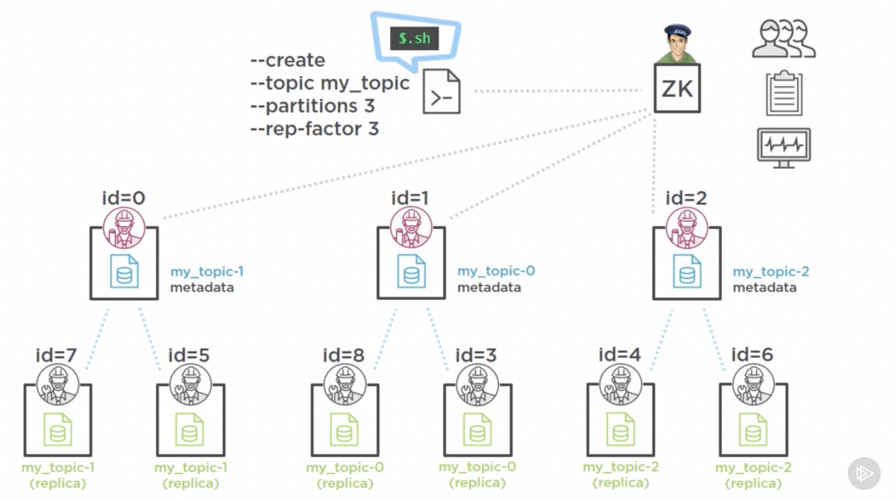
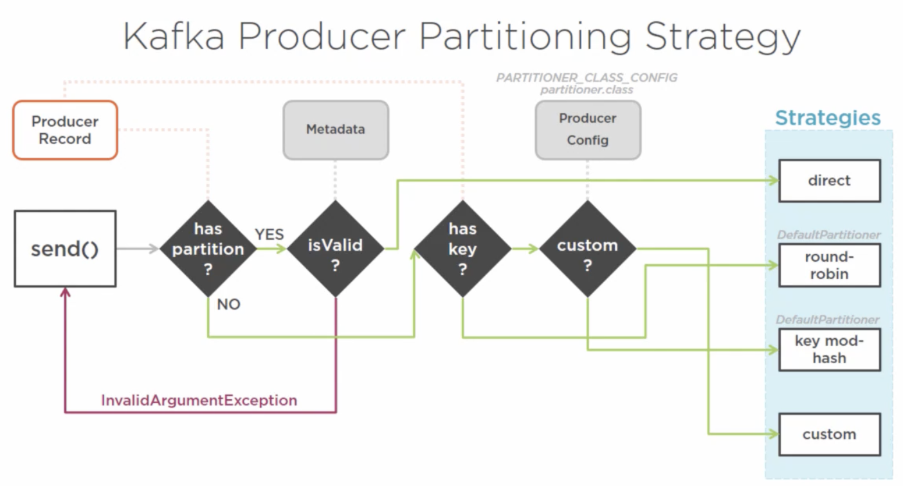
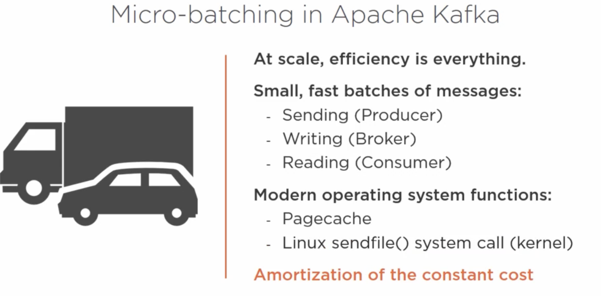
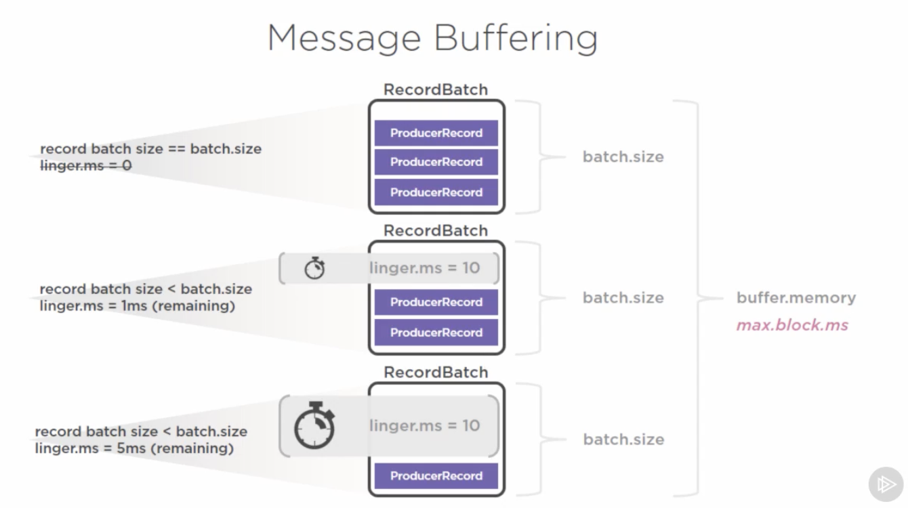
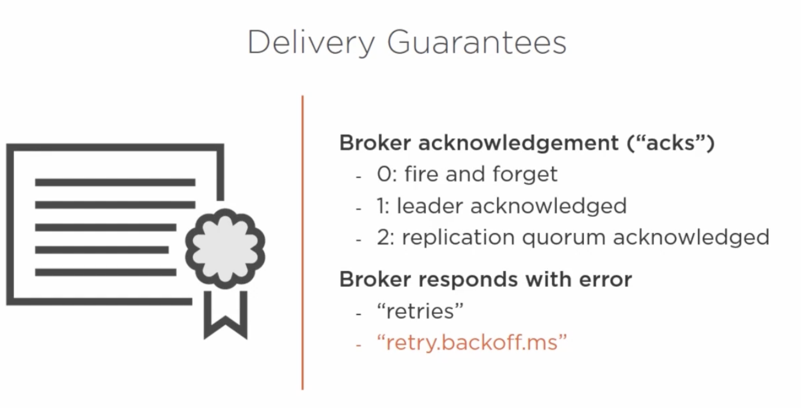
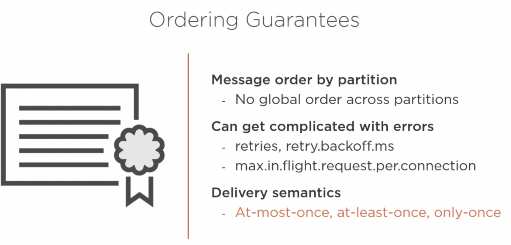

# Getting Started With Apache Kafka
https://app.pluralsight.com/courses/2802039d-8e70-4d95-a366-0f91744db191/table-of-contents

My notes and code going through the Getting Started With Apache Kafka course on Pluralsight

## 1. Course Overview

**Course Goal:** Introduce you to Apache Kafka

- Apache Kafka Architecture
- Distributed Systems Design
- Break down Apache Kafka on different components
- Scenarios and walkthroughs

## 2. Getting Started with Apache Kafka

### What is Apache Kafka?

> A high-throughput distributed messaging system.

Rapidly moving large amount of data from one place to another (data movement).

### Messaging:


Challenges:

- **Limited scalability:** the message broker is often the bottleneck
- **Message size** affects performance
- **Consumer rate** determines performance
- **Fault-tolerance** is challenging. If consumer loses the message is difficult to reprocess

### Kafka

Moves data around:

- cleanly
- reliably
- quickly
- autonomously

Goals:

- High throughput
- Horizontally scalable
- Reliable and durable
- Loosely coupled Producers and Consumers
- Flexible publish-subscribe semantics

## 3. Getting to Know Apache Kafka's Architecture

### Apache Kafka

Kafka is a publish-subscribe messaging system.</br>
Producers == Publishers </br>
Consumers == Subscribers


**Topic** is a collection or a grouping of messages.
Producers sends its messages to a specific *topic*.
Consumers retrieve messages based on the topic they are interested in.


**Broker** is the place where Kafka keeps and maintains messages. It has access to machine's resources and uses the file system to store messages. You can run more than one broker (requires unique settings to avoid conflict). The number of brokers can scale without affecting the existing producers/consumers. The **Kafka Cluster**  is a grouping of multiple Kafka brokers on single or multiple machines.

**Distributed Systems** consist of multiple workers/nodes (e.g Kafka brokers) so the workload is spread. There must be coordination to ensure consistency and optimal progress towards the common goal. Each node communicates with each other through messages.

The **Controller** is worker node that has been elected to maintain:

- an inventory of what workers are available to take on work
- a list of work items tha has been committed to and assigned to workers
- an active status and progress on tasks


**Apache Zookeeper** is the grouping mechanism that determines a Kafka cluster's membership of brokers. It is a centralized service for maintaining metadata about a cluster of distributed nodes. 


## 4. Understanding Topics, Partitions, and Brokers

### Topics

Logical entity that spans the whole cluster. It is physically represented as a log. Named feed/category of messages that:

- producers send messages to
- consumers get messages from

Messages are appended to a time-ordered sequential stream. Each message represents an immutable event.


**Event Sourcing** - an architectural style to maintaining an application's state by capturing all changes as a sequence of time-ordered, immutable events.

Kafka message has:

- Timestamp
- Referenceable identifier
- Payload (binary)

The **Message offset** is how consumers can read messages at their own pace and process them independently. It keeps a record of the lat read message (message identifier) position and it is maintained by the Kafka Consumer.

### Retention policy

Kafka retention policy is configurable on per-topic basis (default is 7 days). It retains all published messages regardless of consumption.

> As a result Kafka is not affected by slow consumers


### Demo

1. Start zookeeper server

```sh
./bin/zookeeper-server-start.sh ./config/zookeeper.properties
```

2. Start Kafka broker

```sh
./bin/kafka-server-start.sh ./config/server.properties
```

3. Create Kafka topic

```sh
./bin/kafka-topics.sh --create --topic my_topic --zookeeper localhost:2181 --replication-factor 1 --partitions 1
```

4. List all Kafka topics

```sh
./bin/kafka-topics.sh --list --zookeeper localhost:2181
```

5. Create Kafka producer

```sh
./bin/kafka-console-producer.sh --broker-list localhost:9092 --topic my_topic
```

6. Create Kafka consumer

```sh
./bin/kafka-console-consumer.sh --zookeeper localhost:2181 --topic my_topic --from beginning
```

### Commit logs (similar to RDBMS)

- Source of truth
- Physically stored and maintained
- Higher-order data structures derive from the log
- Point of recovery
- Basis of replication and distribution

> In essence Kafka is a distributed commit log

### Partitions

[Intro to Kafka Partitions](https://developer.confluent.io/learn-kafka/apache-kafka/partitions/)

Each topic has one or more partitions. Each partition is maintained on at least one or more brokers. Each partition must fit entirely on one machine. Partitions are mutually exclusive - they receive unique messages. Partitions are the basis for which Kafka can:

- Scale
- Become fault-tolerant
- Achieve high throughput


Partitioning takes the single commit topic log and breaks it into multiple logs, each of which can live on a separate node in the Kafka cluster. This way, the work of storing messages, writing new messages, and processing existing messages can be split among many nodes in the cluster.


> Kafka scalability is determined by the number of partitions being managed by multiple broker nodes.

### Distributed Partition Management


*Note:* Because messages are produced to multiple brokers at different times, consumers working with multiple partitions are likely to consume messages in different order. The consumer is responsible for maintaining the order if required.

Trade-offs:

- The more partitions the greater the Zookeeper overhead
- Message global ordering (across partitions) can become complex (Kafka maintains order per partition)
- The more partitions the longer the leader fail-over time

### Reliability

Replication Factor:

- Reliable work distribution (Redundancy of messages)
- Guarantees (N-1 broker failure tolerance (e.g min 2 or 3))
- Configured on per-topic basis



When ISR (In-Sync Replicas) equals the replication factor we can say the partition and the quorum managing it are in a *healthy* state.

## 5. Producing Messages with Kafka Producers


The Producer doesn't connect to every broker referenced in the `bootstrap.servers`, just the first available one. It uses the broker it connects to for discovering the full membership of the cluster. This is to determine the parititon owners (e.g leader). This way it can send the message directly to the leader.

*Good practice:* provide more than one broker in the `bootstrap.servers` list in the unlikely event that the first broker is unavailable.

*Note:* KafkaProducer can only send ProducerRecords that match the key and value serializers types it is configured with.

### ProducerRecord

Properties:

Only `topic` and `value` are required.

```java
class ProducerRecord {
    final String topic;
    final String value;

    String partition; // specific partition within the topic to send ProducerRecords
    String timestamp;
    String key;
}
```

### Key

If set the `key` can determine what partitions the message will be written to. However, it might add overhead depending on the serializer.

Purposes:

- Additional information in the message
- Can determine what partitions the message will be written to

Downside:

- Additional overhead
- Depends on the serializer type

### Sending Messages

1. Producer reaches out to the cluster using the `bootstrap.servers` to discover cluster membership
2. Broker responds with metadata containing information about topics, their partitions and their managing brokers.
3. Throughout the producer's lifecycle, it will keep refreshing the metadata object.
4. Pass the message (`value`) through the configured Serializer.
5. The partitioner determines what partition to send the record to (different partitioning strategies are available).
6. Dispatch the record to the RecordAccumulator (in-memory queue-like data structure). This results in micro-batching of TopicPartition combinations in order to reduce the overhead.

### Partitioning Strategy



### Micro-batching



The batch size is limited by configuration (in bytes).



### Delivery Guarantee



### Ordering Guarantee



## 6. Consuming Messages with Kafka Consumers and Consumer Groups

